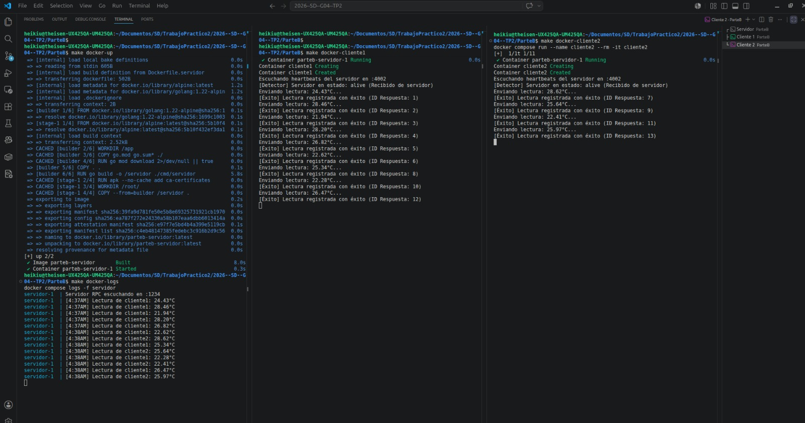
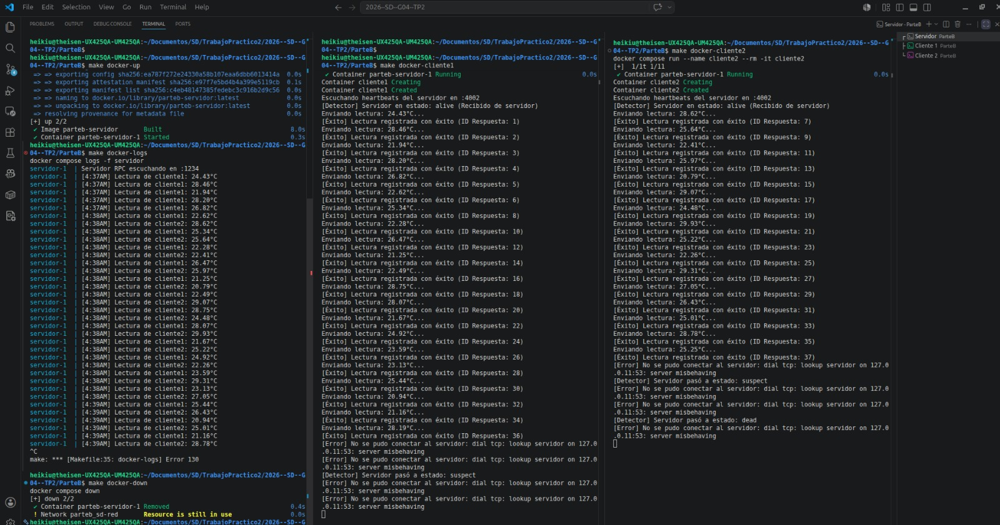
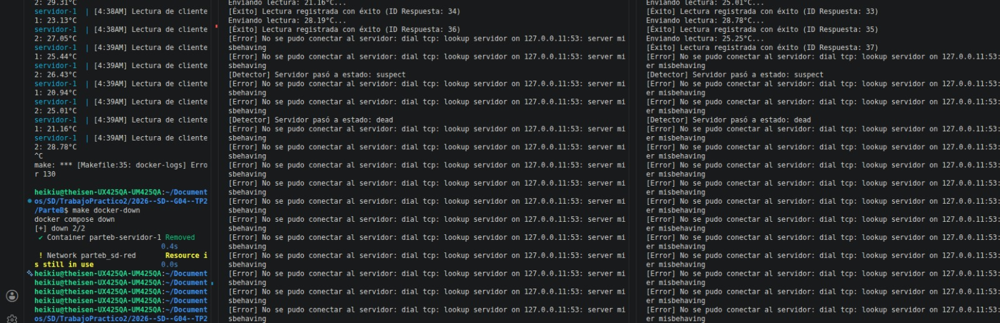

# Servicio de Telemetría con Detección de Fallos

Proyecto base para la parte B de la Práctica Guiada 2: RPC, reintentos y detección de fallos.

## Integrantes

- Gallo Guillermo Ariel
- Pedernera Theisen Nahuel Thomas

## Ejecución

### Local (Linux / Mac - con Make)

```bash
# Terminal 1: Servidor
make run-servidor

# Terminal 2: Cliente
NOMBRE=cliente-a SERVIDOR=localhost:1234 make run-cliente

# Terminal 3: Segundo cliente
NOMBRE=cliente-b SERVIDOR=localhost:1234 make run-cliente
```

### Local (Windows / Manual - sin Make)

Si no tenés `make` instalado, podés compilar los archivos `main.go` directamente a ejecutables y correrlos:

```powershell
# 1. Compilar los ejecutables (se guardan en la carpeta bin/)
go build -o bin/servidor.exe ./cmd/servidor
go build -o bin/cliente.exe ./cmd/cliente

# Terminal 1: Ejecutar Servidor
.\bin\servidor.exe

# Terminal 2: Ejecutar Cliente A
$env:NOMBRE="cliente-a"; $env:SERVIDOR="localhost:1234"; .\bin\cliente.exe

# Terminal 3: Ejecutar Cliente B
$env:NOMBRE="cliente-b"; $env:SERVIDOR="localhost:1234"; .\bin\cliente.exe
```

### Docker Compose (interactivo)

**1. Levantar solo el servidor** (en background):
```bash
make docker-up
```

**2. Conectar clientes** (en terminales separadas):
```bash
# Terminal 2: Cliente 1
make docker-cliente1

# Terminal 3: Cliente 2
make docker-cliente2
```

**3. Ver logs del servidor**:
```bash
make docker-logs
```

**4. Detener todo**:
```bash
make docker-down
```

## Requisitos completados

- [x] Servidor RPC con metodos `RegistrarLectura` y `ObtenerUltimaLectura`
- [x] Protocolo JSON en todos los mensajes (structs con tags json)
- [x] Cliente RPC con loop automatico de lecturas
- [x] Heartbeat UDP: servidor envia, cliente detecta timeout con estados `alive/suspect/dead`
- [x] Docker Compose con al menos 1 servidor + 2 clientes

## Captura de ejecucion

Fase 1: Funcionamiento Normal
El servidor recibe correctamente las peticiones RPC de ambos clientes y registra las temperaturas. Al mismo tiempo, el servidor envía heartbeats por UDP, por lo que los detectores de los clientes marcan el estado del servidor como alive.



Fase 2: Tolerancia a Fallos (Caída del Servidor)
Al detener abruptamente el servidor, los clientes no se cierran. El cliente maneja el error de red, mostrando que no se pudo conectar al servidor (server misbehaving), y continúa su loop intentando reconectar.



Fase 3: Detección Pasiva de Caída (Heartbeat UDP)

Al no haber servidor, los heartbeats UDP dejan de llegar. Luego de unos segundos, el detector supera el timeout establecido. El estado transiciona correctamente de alive a suspect, y finalmente a dead.


